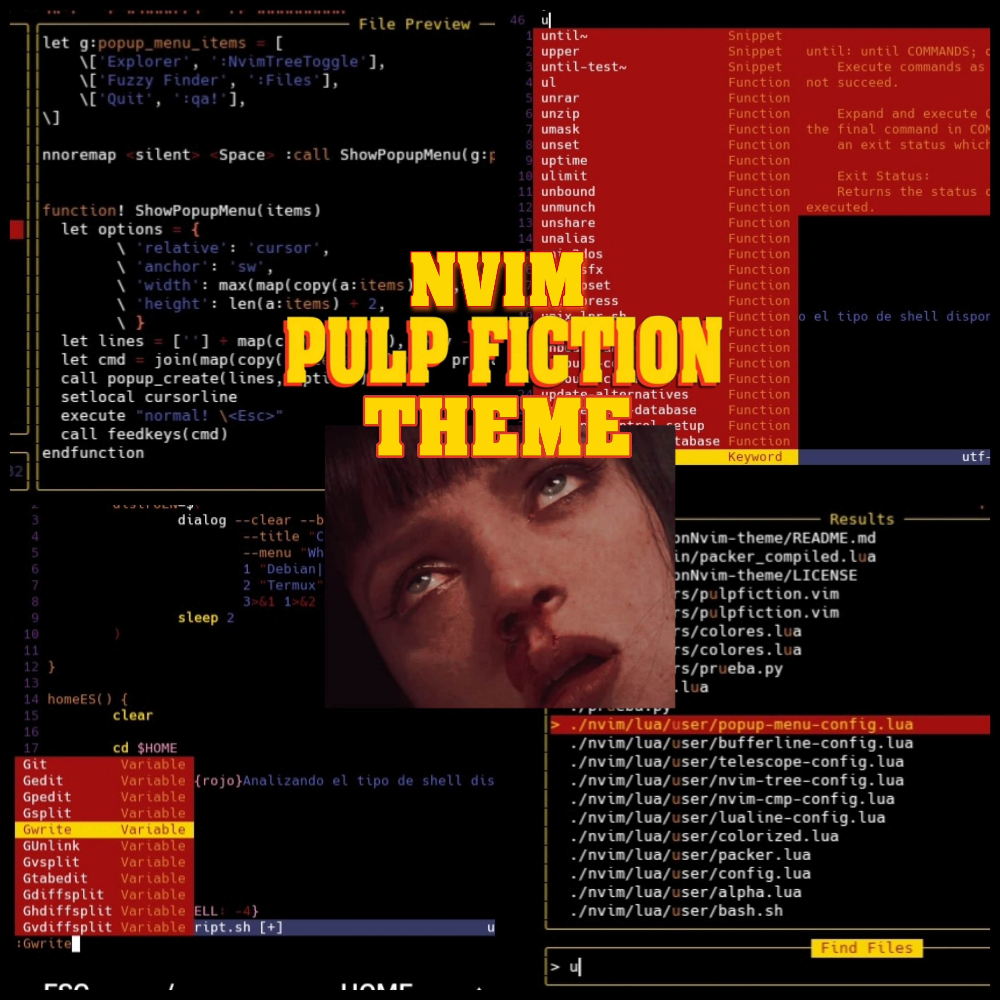

# Pulp Fiction theme

<p align="center">
  

</p>
<p align="Center">
  
  
  
  
</p>

# Installation

Using vim-plug:
```lua
Plug 'RchrdAriza/pulpFictionNvim'
```

Using Packer:
```lua
use 'RchrdAriza/pulpFictionNvim'
```
To use you must modify your init.lua or init.vim file as follows:
```lua
-- using lua:
vim.cmd('colorscheme pulpfiction')
    
-- using VimL 
colorscheme pulpFictionNvim
```
